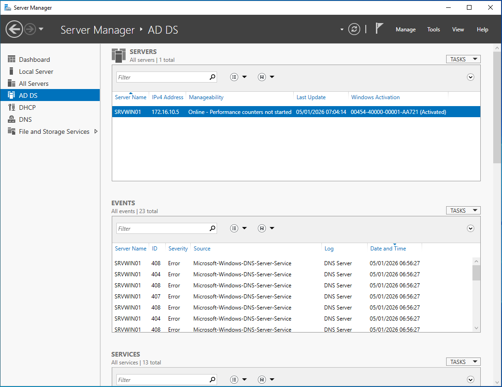

# Active Directory Domain Services - Installation
  
## La fenêtre du Server Manager où on voit clairement que le rôle AD DS est installé
  

  
## La fenêtre de la console Active Directory Users and Computers
  
On voit que le client CLIWIN01 (172.16.10.20) est dans le conteneur Computers.
