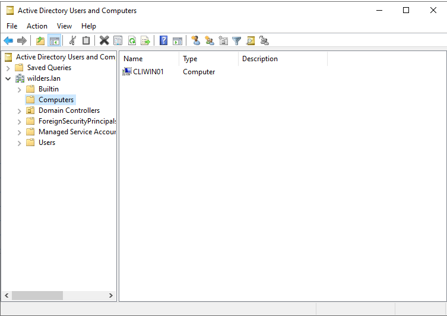

## L'OU utilisateurs où on voit le compte utilisateur

Nous voyons également la fenêtre du groupe utilisateur dans laquelle on voit l'utilisateur membre.  

## L'OU ordinateur où on voit le client

Nous voyons également la fenêtre du groupe ordinateur dans laquelle on voit le client membre.  

## Sur le client, le résultat de la commande whoami

L'utilisateur Wilder1 est bien dans le domaine wilders.lan et se connecte sur CLIWIN01.
